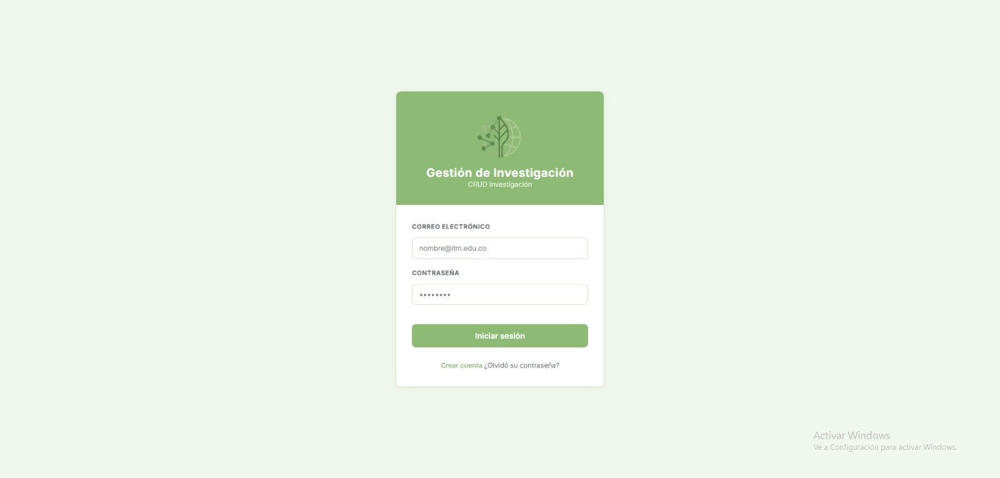

# Frontend — Gestión de Investigación

Aplicación web desarrollada con **Blazor Server (.NET 9)** para la gestión de información de investigación académica. Consume la [API Genérica CRUD](http://apigenericacsharp-mafe.runasp.net/swagger/index.html) y permite administrar grupos de investigación, semilleros, líneas, docentes, ODS y más.

## 🌐 Aplicación publicada

> **URL:** [http://frontblazor-mafe.runasp.net/login](http://frontblazor-mafe.runasp.net/login)



---

## 👤 Usuarios de prueba

| Rol | Correo | Contraseña |
|---|---|---|
| 🔑 Administrador | `administrador@gmail.com` | `12345` |
| 👁️ Invitado | `invitado@gmail.com` | `12345` |

---

## 🔒 Control de acceso por roles

### 👁️ Invitado — acceso de solo lectura

| Sección | Páginas accesibles |
|---|---|
| **Home** | Inicio |
| **Tablas sin FK** | Línea de Investigación, Área de Conocimiento, Área de Aplicación, ODS |
| **Tabla Maestro-Detalle** | Grupos con Semilleros |
| **Panel de Consultas** | Los 10 reportes multitabla |

### 🔑 Administrador — acceso completo

Todo lo del Invitado más:

| Sección | Páginas adicionales |
|---|---|
| **Tablas con FK** | Grupo de Investigación, Semillero |
| **Relación con Grupo** | Participa Grupo |
| **Relación con Semillero** | Participa Semillero |
| **Relación con Líneas** | Grupo-Línea, AC-Línea, AA-Línea, Semillero-Línea, ODS-Línea |
| **Dashboard** | Gráficas y estadísticas generales |

---

## 📋 Módulos del sistema

### Tablas sin FK
Entidades base sin dependencias externas — CRUD completo.
- **Línea de Investigación** — nombre y descripción
- **Área de Conocimiento** — gran área, área y disciplina
- **Área de Aplicación** — nombre
- **ODS** (Objetivos de Desarrollo Sostenible) — nombre y categoría

### Tablas con FK
Entidades con dependencias — CRUD completo.
- **Grupo de Investigación** — nombre, categoría, ámbito, fecha de fundación, URL GrupLAC
- **Semillero** — nombre, fecha de fundación, grupo padre

### Tabla Maestro-Detalle
- **Grupos con Semilleros** — visualización jerárquica de grupos y sus semilleros asociados

### Tablas de relación N:M
- **Participa Grupo** — docentes vinculados a grupos con rol y fechas
- **Participa Semillero** — docentes vinculados a semilleros con rol y fechas
- **Grupo-Línea** — grupos asociados a líneas de investigación
- **AC-Línea** — áreas de conocimiento asociadas a líneas
- **AA-Línea** — áreas de aplicación asociadas a líneas
- **Semillero-Línea** — semilleros asociados a líneas
- **ODS-Línea** — ODS asociados a líneas de investigación

### 📊 Dashboard *(solo Administrador)*
4 gráficas generadas con **ApexCharts**:
- Grupos por categoría (barras)
- Áreas de conocimiento más investigadas (torta)
- Evolución de fundaciones por año (líneas)
- Top grupos con más líneas (barras horizontales)

### 📋 Panel de Consultas *(ambos roles)*
10 reportes multitabla (mínimo 4 tablas por consulta):

| # | Reporte | Tablas |
|---|---|---|
| 1 | Radiografía Completa de Semilleros | 4 |
| 2 | Impacto Social de la Investigación (ODS) | 4 |
| 3 | Vinculación de Docentes a Semilleros | 5 |
| 4 | Resumen de Grupos (docentes + líneas) | 5 |
| 5 | Resumen de Semilleros (líneas + docentes) | 5 |
| 6 | Áreas de Aplicación vinculadas a ODS | 5 |
| 7 | Grupos y cobertura de Áreas de Aplicación | 5 |
| 8 | Docentes en Grupos con sus Líneas | 5 |
| 9 | Líneas de Investigación y Vinculación Científica | 5 |
| 10 | Vista 360° de un Semillero | 6 |

---

## 🛠️ Tecnologías

| Tecnología | Versión | Uso |
|---|---|---|
| .NET / Blazor Server | 9.0 | Framework principal |
| Blazor-ApexCharts | 6.1.0 | Gráficas del Dashboard |
| Bootstrap Icons | — | Iconografía del sistema |
| CSS personalizado (`crud.css`) | — | Sistema de diseño en verde |

---

## 🏗️ Estructura del proyecto

```
FrontBlazor_AppiGenericaCsharp/
├── Components/
│   ├── Layout/
│   │   ├── MainLayout.razor       # Layout principal con NavMenu
│   │   ├── EmptyLayout.razor      # Layout vacío para Login
│   │   └── NavMenu.razor          # Menú lateral colapsable por secciones
│   └── Pages/
│       ├── Login.razor
│       ├── Home.razor
│       ├── Dashboard/
│       │   └── Dashboard.razor
│       ├── Reportes/
│       │   ├── Reporte1RadiografiaSemilleros.razor
│       │   ├── Reporte2ImpactoSocial.razor
│       │   └── ... (10 reportes)
│       ├── GrupoInvestigacion.razor
│       ├── Semillero.razor
│       └── ... (demás páginas CRUD)
├── Services/
│   ├── ApiService.cs              # Cliente HTTP para la API
│   └── SpService.cs               # Servicio de Stored Procedures
└── wwwroot/
    └── css/
        └── crud.css               # Sistema de diseño global
```

---

## ⚙️ Configuración (`appsettings.json`)

```json
{
  "ApiSettings": {
    "BaseUrl": "http://apigenericacsharp-mafe.runasp.net/"
  }
}
```

---

## 🚀 Ejecutar localmente

```bash
# Clonar el repositorio
git clone https://github.com/tu-usuario/FrontBlazor_AppiGenericaCsharp.git
cd FrontBlazor_AppiGenericaCsharp

# Restaurar dependencias
dotnet restore

# Ejecutar
dotnet run

# Aplicación disponible en:
# https://localhost:{puerto}
```

> Requiere que la API esté corriendo. Puede apuntar a la API publicada o a una instancia local.

---

## 👩‍💻 Autora

Desarrollado por **María Fernanda Palacio** — Ingeniería de Software, ITM  
Proyecto académico — 2026
